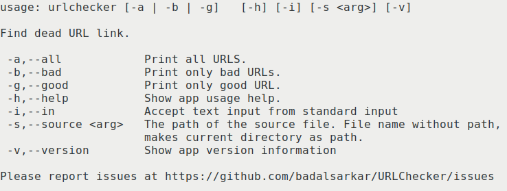
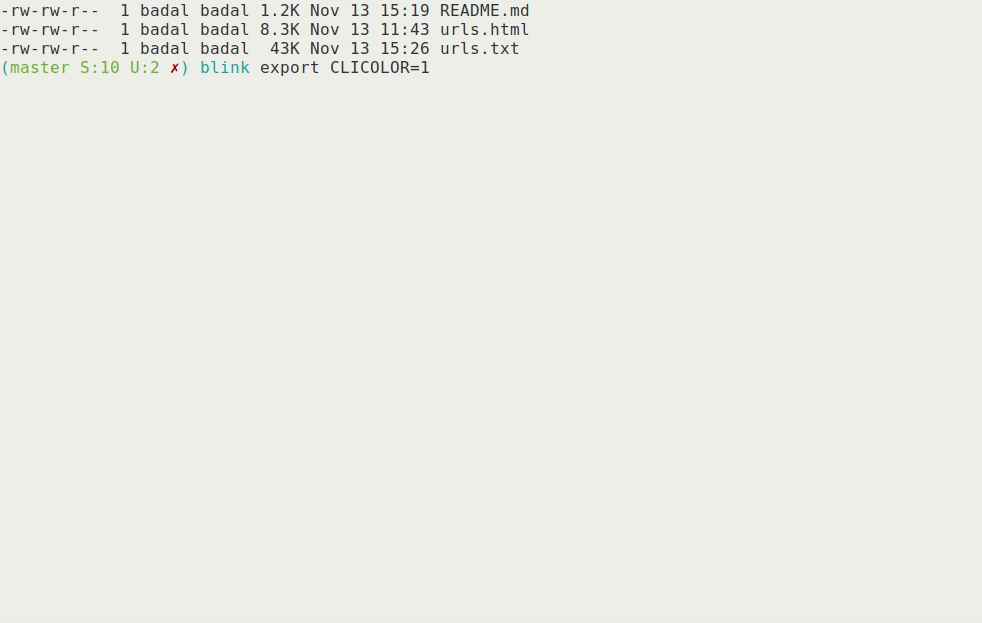

# Blink

Blink is a command line application to detect invalid URLs.

## Available Features

- Check invalid URL with HTTP/HTTPS scheme in a html/txt file
- Color output of validation result
- Use environmental variable to control color print. Set `CLICOLOR=1` for color
print to console.

## How to install

Run `./mvnw clean compile assembly:single`. This will create `Blink.jar` file
inside `target` directory.

## Available Options



## How To Use

**To process a file-**

```bash
java -jar /path/to/Blink.jar/ -s /path/to/the/file
```


**To activate color output-**

```bash
export CLICOLOR=1
java -jar /path/to/Blink.jar -s /path/to/the/file
```



**Pipe text from another process**

```bash
curl -s https://github.com/badalsarkar/Blink | java -jar /path/to/Blink.jar -i
```


**To Show Help**

```bash
java - jar /path/to/Blink.jar -h
```

**To Show Version**

```bash
java -jar /path/to/Blink.jar -v
```

## Under Development

- Process multiple file
- Process files recursively from directory
- Support for glob pattern
- Parallel processing of different tasks, specifically reading from file, making
http request and printing to screen and writing to file

## Contributing

Read the contribution [guide](./CONTRIBUTING.md) .
